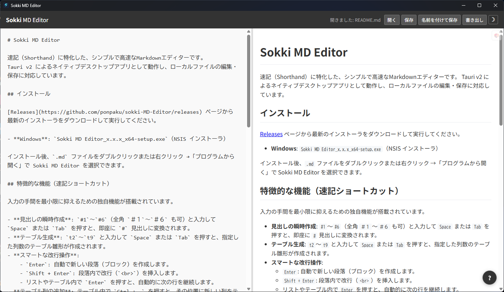

# Sokki MD Editor

速記（Shorthand）に特化した、シンプルで高速なMarkdownエディターです。
Tauri v2 によるネイティブデスクトップアプリとして動作し、ローカルファイルの編集・保存に対応しています。

## インストール

[Releases](https://github.com/ponpaku/sokki-MD-Editor/releases) ページから最新のインストーラをダウンロードして実行してください。

- **Windows**: `Sokki MD Editor_x.x.x_x64-setup.exe`（NSIS インストーラ）

インストール後、`.md` ファイルをダブルクリックまたは右クリック →「プログラムから開く」で Sokki MD Editor を選択できます。

## 特徴的な機能（速記ショートカット）

入力の手間を最小限に抑えるための独自機能が搭載されています。

- **見出しの瞬時作成**: `#1`〜`#6`（全角 `＃１`〜`＃６` も可）と入力して `Space` または `Tab` を押すと、即座に `#` 見出しに変換されます。
- **テーブル生成**: `t2`〜`t9` と入力して `Space` または `Tab` を押すと、指定した列数のテーブル雛形が作成されます。
- **スマートな改行操作**:
    - `Enter`: 自動で新しい段落（ブロック）を作成します。
    - `Shift + Enter`: 段落内で改行（` `）を挿入します。
    - リストやテーブル内で `Enter` を押すと、自動的に次の行を継続します。
- **テーブル列の追加**: テーブル内で `Ctrl + .` を押すと、その位置に新しい列をテーブル全体に追加します。

## キーボードショートカット

| ショートカット | 操作 |
|---|---|
| `Ctrl + O` | ファイルを開く |
| `Ctrl + S` | 保存 |
| `Ctrl + Shift + S` | 名前を付けて保存 |
| `Ctrl + B` | 太字 |
| `Ctrl + I` | 斜体 |
| `Ctrl + U` | 下線 |
| `Ctrl + .` | テーブルに列を追加 |

## エクスポート機能

Markdown で書いた文章をそのまま他のフォーマットへ変換できます。
Markdown を書く → ボタン一つで Word や PDF に変換、という使い方も可能です。

| 形式 | 説明 |
|---|---|
| **Word (.docx)** | 見出し・太字・リスト・テーブルなどの書式を保持したまま変換 |
| **PDF** | 用紙サイズ・余白を指定して出力 |
| **HTML** | スタイル付きの単一 HTML ファイルとして保存 |
| **プレーンテキスト (.txt)** | Markdown 記法を除去したテキストとして保存 |

## その他の機能

- **スクロール同期**: エディターとプレビューのスクロール位置がリアルタイムで同期
- **自動保存**: 編集中の内容は自動的にスナップショットとして保存され、アプリが強制終了しても復元可能
- **テーマ切替**: ライト / ダークテーマ
- **多言語対応**: 日本語 / 英語
- **プレビュースタイル**: フォントやサイズのカスタマイズ

## 開発者向け情報

開発環境のセットアップについては [CLAUDE.md](./CLAUDE.md) を参照してください。

## ライセンス

MIT License
